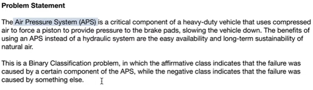

## 1. To create conda environment<br>
```conda create -n myenv python=3.12.2```<br>
```conda create -p myenv python=3.12.2```<br>
* Specifies the path `(-p)` where the environment will be created. In this case, the environment named `"myenv"` will be created directly in the current directory, rather than within the Conda environment directory. This allows for more flexibility in specifying the location of the environment.

## 2. Create a folder like "sensor"
    Now initialize it into pakage using "__init__.py"(convert normal folder to pakage)
    Packages can be accessed where ever we want(python pakages are stored in "pypi")

## 3. To run setup file<br>
```pip setup.py install```<br>
All the libraries are installed through this file.
Used to manage `dependencies` and also used to manage `distribution`
When we run setup file it will convert the folders into pakages that we have initialized with "__init__.py"
- One time run command: `python setup.py install` to run one time installation in the project

## 4. To run requirements file<br>
```pip install -r requirements.txt```

# <u>Problem Statement of the project</u>


# Solution of the problem
System/project will predict if their is an issue in `APS`(Air Pressure Sysytem) `yes or no` if any fault it will tells whether for service or not saving checking cost due to no need for regular checking<br>
`APS` is an instrument in heavy machineries for brakes<br>
Two classes of binary classification positive and negative. Positive for component failer and negative for other reasons.

## 5. `Creating folder into Pakage` to use the folder in the project
We use `__init__.py` to form a `pakage file` can be used `accessed` everywhere and can be used by other modules and `all the pakages` are avalable in `pypi.org` we use pip to capture libraries prom pypi.

## 6. Setup File:
**`All the libraries are installed through this file.`** and hanadles package related things.
- A `Setup File` usually refers to `setup.py`, which is a Python script used for `package distribution and installation`.
- When you develop a Python `package` of a file like `sensor`, you create a `setup.py` file to `define metadata` about your package, such as its `name, version, author, dependencies, etc`.
- The setup.py file is `crucial` for building, distributing, and installing your Python package using tools like `pip`.
- `python setup.py install` to run one time installation in the project
- Package `related information` or `metadata` after the `creation of package` from the `folder` after running the `setup file` saves in `.egg` file

## 7. Exception File(this file can be used in any python project)
Used in any project involves python
- An "Exception File" is not a standard term in Python. However, it could refer to a file where you handle exceptions(errors) in your Python code.
- In Python, exceptions are raised when `errors occur` during program execution. You can `catch and handle` these exceptions using `try and except` blocks.
- An "Exception File" could be where you write code to `catch and manage these exceptions`, such as logging them or displaying error messages to users.
- `python main.py` to run exceptions

## 8. Logger File
Used in any project involves python
- A `Logger File` typically refers to a Python `script or module` where you set up `logging` functionality.
- In Python, the logging module provides a `flexible framework` for `emitting log messages` from your application.
- A `Logger File` might contain code to configure logging handlers, formatters, and loggers to capture information about the application's behavior during runtime.

## 9. .egg-info Folder:
- The `.egg-info` folder is a `directory` created when you `install a Python package using setuptools` or distribute.
- It contains `metadata` about the `installed package`, such as its `name, version, dependencies, and other` information specified in the `setup.py` file.
- This metadata is used by `package management` tools like `pip` to manage installed packages and their dependencies.